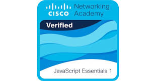

<!DOCTYPE html>
<html lang="en">
<head>
  <meta charset="UTF-8" />
  <meta name="viewport" content="width=device-width, initial-scale=1.0" />
  <title>Poloju Vikram | Salesforce Developer & Cyber Security Analyst</title>
  <link rel="stylesheet" href="style.css" />
</head>
<body>
<header class="navbar">
    

      
    

  
    <button class="navbar__toggle" id="menu-toggle" aria-label="Toggle navigation" aria-expanded="false">
      ☰
    </button>
  
    <nav class="navbar__menu" id="nav-links">
      <a href="#about" class="navbar__link">About</a>
      <a href="#skills" class="navbar__link">Skills</a>
      <a href="#experience" class="navbar__link">Experience</a>
      <a href="#education" class="navbar__link">Education</a>
      <a href="#projects" class="navbar__link">Projects</a>
      <a href="#certificates" class="navbar__link">Certificates</a>
      <a href="resume.pdf" download class="navbar__resume">Resume</a>
    </nav>
  </header>
<!--About Section Design-->
 
  <section id="about" class="hero">
    

      
Hello There! 👋

      <h1>I am Poloju Vikram</h1>
      <h2>Salesforce Developer & Cyber Security Analyst</h2>
      
Salesforce Developer with 1+ years experience, 3x Salesforce certifications, skilled in Apex, LWC, Visualforce, and Salesforce integrations.

      
    

    

      
    

  </section>

  <section id="Certificates">
    <h2>3X Salesforce Certified and 3 Star Ranger</h2>
    

      
      
      
      
      
      
      
      
      
    

  </section>
     
    
<section class="specializations">
  

    <h4>— My Expertise</h4>
    <h1>Salesforce Specializations.</h1>
    

      Combining technical expertise with a passion for creating innovative Salesforce solutions.
    

  

  

    

      01
      
Salesforce Configuration

    

    

      02
      
Salesforce customization

    

    

      03
      
Salesforce development

    

    

      04
      
Integration & APIs

    

  

</section>
  <!--Skills Section Design-->
  <section id="Skills">
    
Profiles

    
Roles

    
Permission Sets

    
Sharing Settings

    
Approval Process

    
Flow Builder

    
Data Loader
 
    
Change Sets
 
    
Apex Classes

    
Apex Triggers

    
Batch Apex

    
Controllers

    
LWC

    
Aura
  
    
REST API

    
Integration

    
SOQL

    
Data Migration

  </section>
  <!-- Experience Section Design-->

 <section class="experience-section">
    

      <h4 class="subheading">— Professional Journey</h4>
      <h1 class="main-heading">Work  Experience.</h1>
      

        Delivering innovative Salesforce solutions and driving business success through technical expertise.
      

    

  
    

      
December 2024 - present

      <h2 class="company">Ankiome Soft India</h2>
      <h3 class="role">Software Engineer (Salesforce)</h3>
      <ul class="highlights">
        <li>Developed custom Salesforce applications using Apex, LWC, and Visualforce, streamlining client processes and improving efficiency.</li>
        <li>Automated workflows and approval processes with Salesforce Flow, significantly reducing manual tasks and boosting productivity.</li>
        <li>Integrated Salesforce with third-party tools and APIs, enhancing data sync and automating business operations.</li>
        <li>Delivered scalable, high-performance solutions that increased user adoption and optimized client workflows.</li>
      </ul>
    

  </section>

  <!--  Education Section Design-->
<section class="education-section" >
    

      <h4 class="subheading">— Academic Journey</h4>
      <h1 class="main-heading">Education  Background.</h1>
      

        Building strong foundations through academic excellence and continuous learning.
      

    

 
    

      

        
2023 – 2025

        <h3 class="edu-title">M.Tech in Computer Networking and Information Security </h3>
        
JNTUH – Jawaharlal Nehru Technological University, Hyderabad

      

    

      

        
2019 – 2023

        <h3 class="edu-title">BTech in Computer Science & Engineering </h3>
        
KVSRIT – Dr.K.V.Subba Reddy Institute of Technology, Kurnool

      

  
      

        
2017 – 2019

        <h3 class="edu-title">Higher Secondary</h3>
        
 Sri Chaitanya Junior Kalasala ,Hyderabad

      

    

  </section>

  <!--  Projects Section Design-->
 <section id="Projects">
  

    <h4 class="subheading">— Professional Work</h4>
    <h1 class="main-heading">Client  Projects.</h1>
    

      Delivering innovative Salesforce solutions across diverse business requirements.
    

  

  

    <!-- Project 01 -->
    

      

        01
        
Salesforce Integration with WhatsApp

        &#x25BC; <!-- Down Arrow -->
      

      

        <table>
          <tr><th>Company</th><th>Duration</th><th>Team Size</th></tr>
          <tr><td>Ankiome Soft</td><td>2 months</td><td>2</td></tr>
        </table>
        <h3>Roles & Responsibilities</h3>
        <ul>
          <li>Configured and implemented Salesforce integration with WhatsApp for real-time customer communication.</li>
          <li>Created Flows to automate WhatsApp notifications for leads, opportunities, and case updates.</li>
          <li>Implemented secure integration using the WhatsApp Business API, ensuring compliance with data protection standards.</li>
          <li>Enhanced customer service by enabling seamless integration between Salesforce and WhatsApp.</li>
        </ul>
      

    

    <!-- Project 02 -->
    

      

        02
        
Salesforce Configuration and Development

        &#x25BC;
      

      

        <table>
          <tr><th>Company</th><th>Duration</th><th>Team Size</th></tr>
          <tr><td>Ankiome Soft</td><td>2 months</td><td>2</td></tr>
        </table>
        <h3>Roles & Responsibilities</h3>
        <ul>
          <li>Configured and customized Salesforce.com (Sales Cloud), including workflows, approval processes, and page layouts.</li>
          <li>Developed Apex classes, Test Classes, Triggers, and LWC components to meet client requirements.</li>
          <li>Automated processes using Salesforce Flows and created validation rules to ensure data integrity.</li>
          <li>Integrated Salesforce with PostgreSQL, Chatlio, and Rippling to enhance system functionality and data synchronization.</li>
          <li>Collaborated with clients across different time zones to ensure clear communication and timely delivery.</li>
        </ul>
      

    

    <!-- Project 03 -->
    

      

        03
        
Salesforce Configuration and Development

        &#x25BC;
      

      

        <table>
          <tr><th>Company</th><th>Duration</th><th>Team Size</th></tr>
          <tr><td>Ankiome Soft</td><td>4 months</td><td>5</td></tr>
        </table>
        <h3>Roles & Responsibilities</h3>
        <ul>
          <li>Contributed to the architecture and design of Salesforce solutions for the Sales Cloud.</li>
          <li>Created custom objects, approval processes, and workflows to automate business processes.</li>
          <li>Worked with PostgreSQL for data storage and developed custom solutions for the business.</li>
          <li>Ensured the timely accomplishment of tasks and projects.</li>
        </ul>
      

    

    <!-- Project 04 -->
    

      

        04
        
Salesforce Configuration and Development

        &#x25BC;
      

      

        <table>
          <tr><th>Company</th><th>Duration</th><th>Team Size</th></tr>
          <tr><td>Ankiome Soft</td><td>3 months</td><td>1</td></tr>
        </table>
        <h3>Roles & Responsibilities</h3>
        <ul>
          <li>Advised the team on Salesforce best practices and delivered optimal solutions to meet business needs.</li>
          <li>Created custom objects, fields, and approval processes to automate business workflows.</li>
          <li>Developed LWC forms for data entry and integration with Salesforce.</li>
          <li>Configured Salesforce email services, custom email templates, and automated notifications.</li>
        </ul>
      

    

  

</section>

 <!--  footer Section Design-->
<footer class="footer">
    

      
Built with ❤️ using Salesforce LWC

    

    

      
      
      
      raftervikram@gmail.com
    

  </footer>
  

  

</body>
</html>
